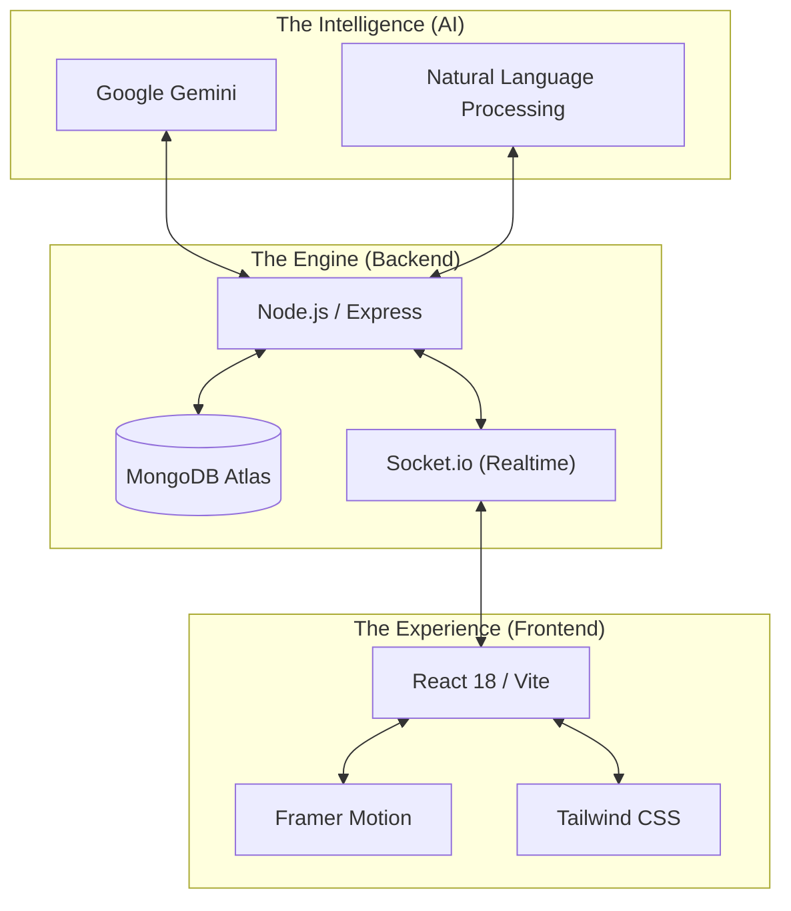
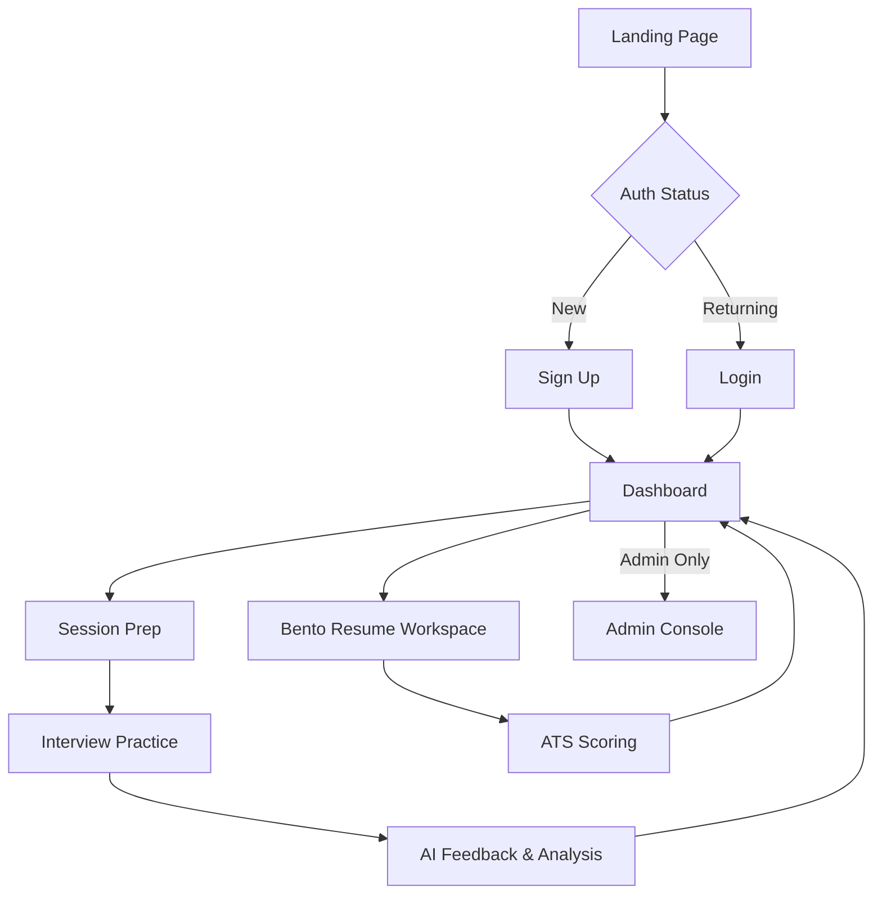
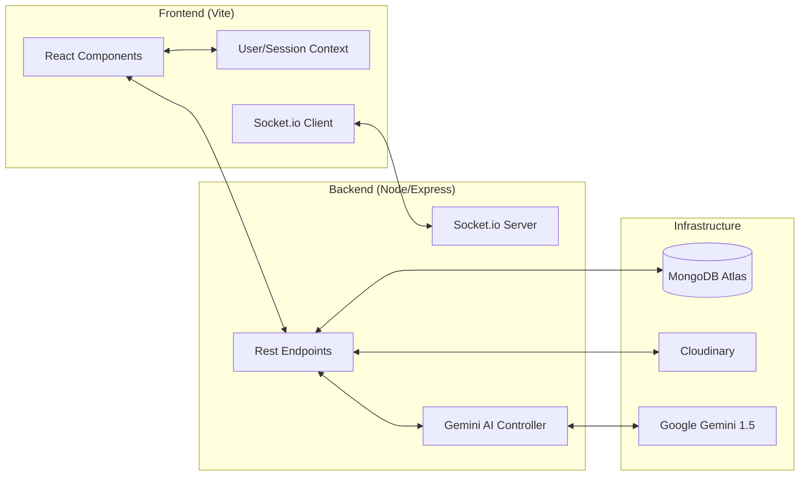

#  MockMate: AI-Powered Interview Excellence

[](https://mockmateapp.vercel.app)


MockMate is a cutting-edge platform designed to bridge the gap between preparation and performance. By leveraging the power of **Google Gemini**, MockMate provides real-time, personalized interview practice, ATS-compliant resume analysis, and a suite of tools to help you land your dream job with confidence.

---

## The Innovation Stack




## The Walkthrough Timeline

Follow the journey of an aspiring candidate using MockMate to master their next interview.

### Phase 1: Preparation (Context is Key)
Before jumping into a seat, you need to define your targets. MockMate allows you to create specialized practice sessions based on specific job roles and company cultures.


### Phase 2: Practice (The Arena)
Practice makes perfect. Choose between HR-style behavioral rounds, session-specific technical drills, or the high-intensity **Live Interview** mode.


### Phase 3: Analysis (The Feedback Loop)
Your resume is your gateway. Use our Bento-style resume workspace to manage your source links, get AI-powered improvement tips, and run an ATS analysis against your target roles.


### Phase 4: Management (Admin Control)
For administrators, the control center provides a bird's-eye view of users, sessions, and system-wide communications via broadcasts and dynamic toasts.


### Phase 5: Coaching (CoachMate)
Your personal AI career companion. CoachMate provides real-time guidance, interview tips, and ATS resume advice in a conversational interface. It's designed to be your supportive placement friend, keeping you motivated and prepared.

<p align="center">
  
  
</p>


## System Architecture

### User Flow Diagram


### High-Level Architecture



## Want to Clone this project? 

### Prerequisites
- Node.js (v18+)
- MongoDB Atlas Account
- Google Gemini API Key
- Cloudinary Account (for resume/asset storage)

### Installation

1. **Clone the project**
   ```bash
   git clone https://github.com/akhilthirunalveli/MockMate.git
   cd MockMate
   ```

2. **Backend Configuration**
   ```bash
   cd backend
   npm install
   # Create a .env file based on .env.example
   npm run dev
   ```

3. **Frontend Configuration**
   ```bash
   cd ../frontend
   npm install
   # Create a .env file based on .env.example
   npm run dev
   ```

<p align="center">Made by Akhil Thirunalveli</p>
