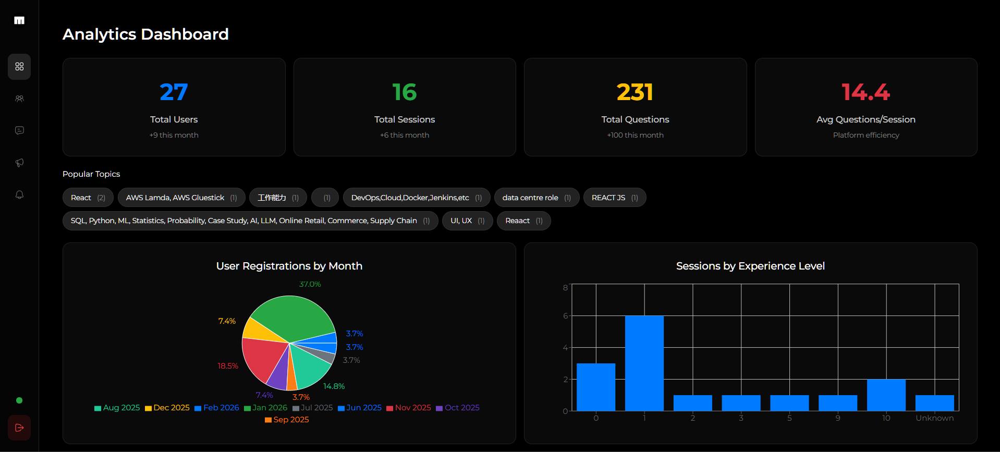
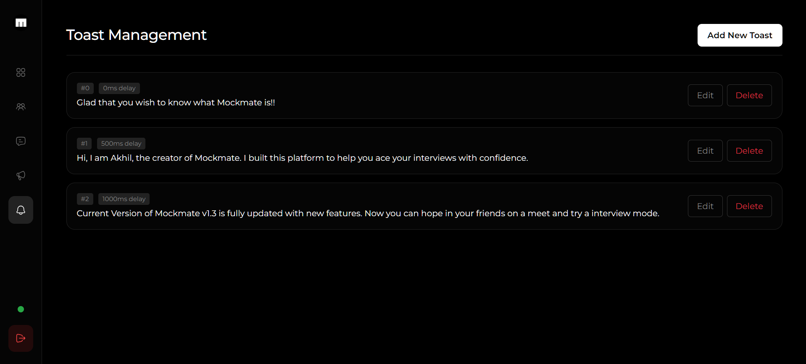
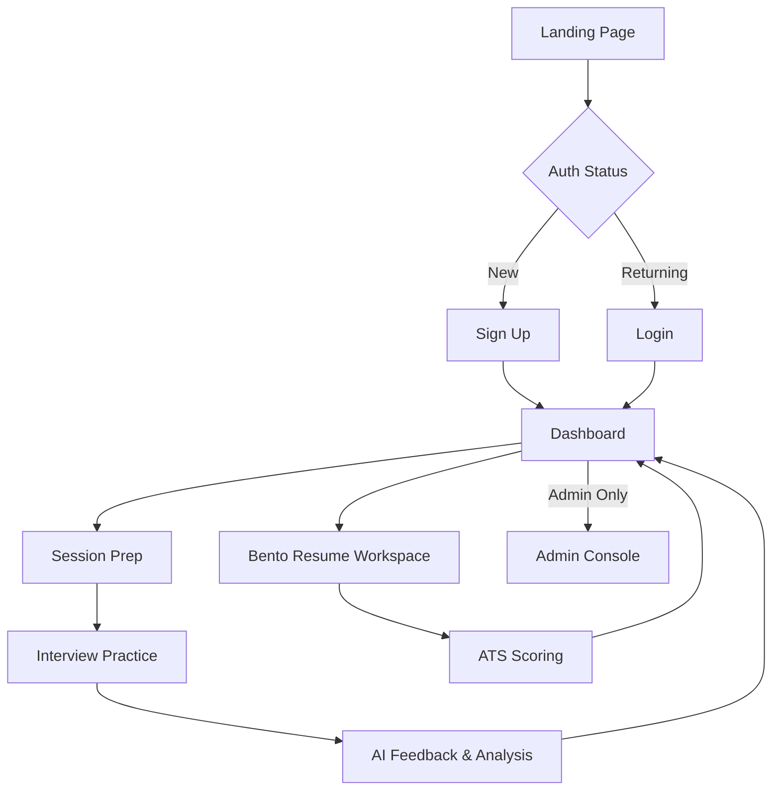
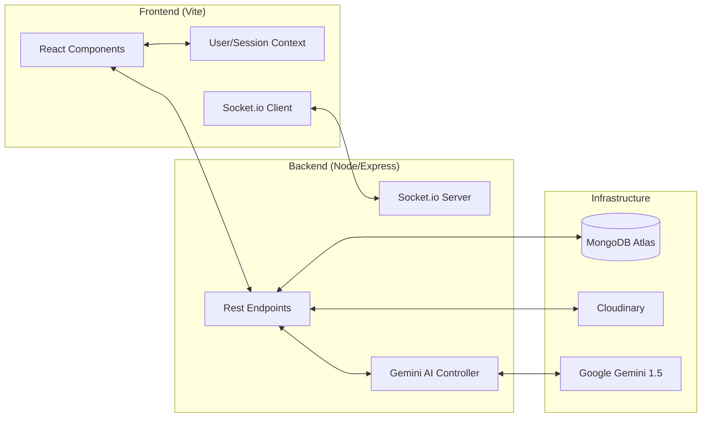

#  MockMate: AI-Powered Interview Excellence


MockMate is a cutting-edge platform designed to bridge the gap between preparation and performance. By leveraging the power of **Google Gemini 1.5 Flash**, MockMate provides real-time, personalized interview practice, ATS-compliant resume analysis, and a suite of tools to help you land your dream job with confidence.

---

## 🛠️ Tech Stack

### Frontend
- **Framework**: React 18 with Vite
- **Styling**: Tailwind CSS & Vanilla CSS
- **Animations**: Framer Motion (for premium, liquid-smooth transitions)
- **Icons**: HugeIcons-React & React Icons
- **State Management**: React Context API (User & Session)

### Backend
- **Runtime**: Node.js & Express
- **Database**: MongoDB with Mongoose
- **Real-time**: Socket.io (for low-latency Live Interview streaming)
- **AI Engine**: Google Gemini 1.5 Flash API
- **Storage**: Cloudinary (Asset management)

---

## 🚀 The Walkthrough Timeline

Follow the journey of an aspiring candidate using MockMate to master their next interview.

### Phase 1: Preparation (Context is Key)
Before jumping into a seat, you need to define your targets. MockMate allows you to create specialized practice sessions based on specific job roles and company cultures.


### Phase 2: Practice (The Arena)
Practice makes perfect. Choose between HR-style behavioral rounds, session-specific technical drills, or the high-intensity **Live Interview** mode.


### Phase 3: Analysis (The Feedback Loop)
Your resume is your gateway. Use our Bento-style resume workspace to manage your source links, get AI-powered improvement tips, and run an ATS analysis against your target roles.


### Phase 4: Management (Admin Control)
For administrators, the control center provides a bird's-eye view of users, sessions, and system-wide communications via broadcasts and dynamic toasts.





---

## 📊 System Architecture

### User Flow Diagram


### High-Level Architecture


---

## 🛠️ Getting Started

### Prerequisites
- Node.js (v18+)
- MongoDB Atlas Account
- Google Gemini API Key
- Cloudinary Account (for resume/asset storage)

### Installation

1. **Clone the project**
   ```bash
   git clone https://github.com/akhilthirunalveli/MockMate.git
   cd MockMate
   ```

2. **Backend Configuration**
   ```bash
   cd backend
   npm install
   # Create a .env file based on .env.example
   npm run dev
   ```

3. **Frontend Configuration**
   ```bash
   cd ../frontend
   npm install
   # Create a .env file based on .env.example
   npm run dev
   ```

<p align="center">Made by Akhil Thirunalveli</p>
