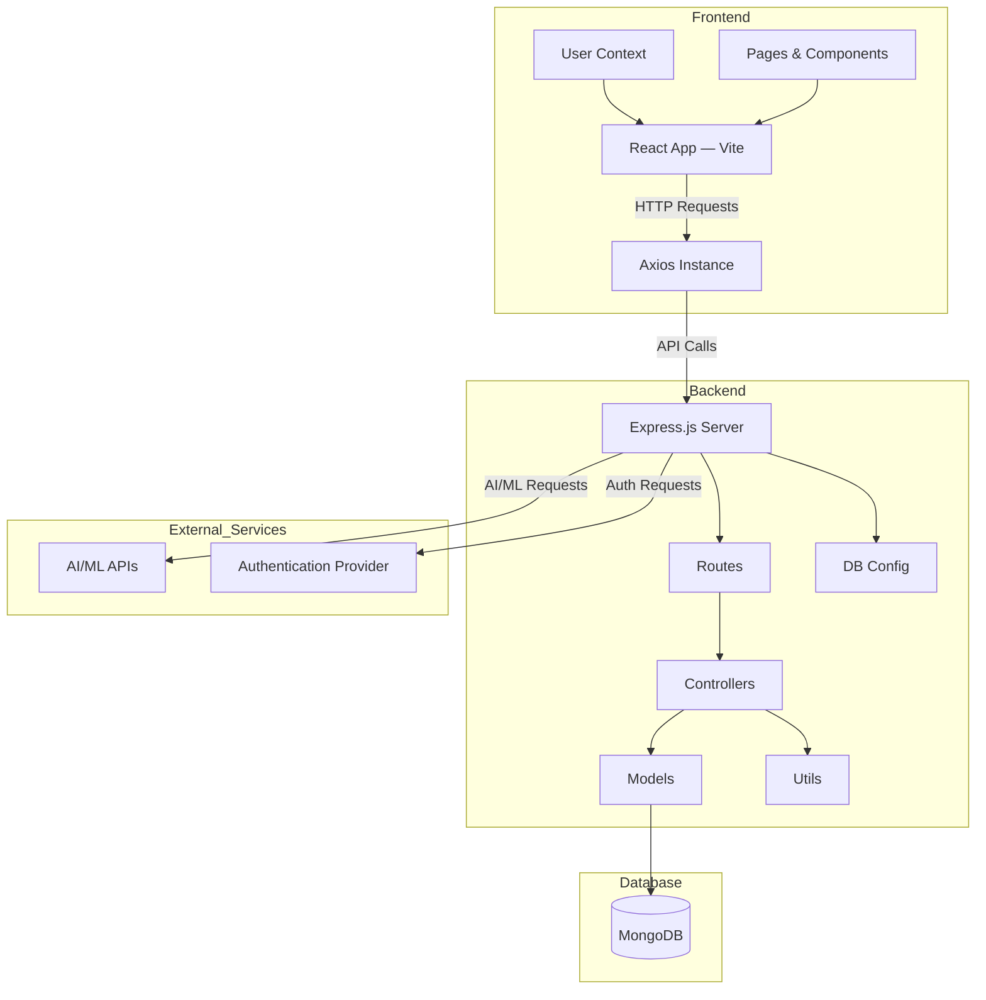

# MockMate System Diagram

Below is a high-level system architecture diagram for MockMate, visualized using Mermaid.

**Legend:**
- **Frontend:** React app (Vite), user context, pages/components, and Axios for API calls.
- **Backend:** Express.js server, controllers, models, routes, DB config, and utility functions.
- **Database:** MongoDB for data storage.
- **External Services:** AI/ML APIs for interview analysis, and authentication provider (e.g., OAuth).

---

Notes:
- GitHub's Mermaid parser is sensitive to certain label characters and layout; quoting labels and using `flowchart TD` with safe node ids avoids common parse errors.
- If rendering still fails on GitHub, view the diagram at https://mermaid.live by copying the mermaid block there.

For more details, see the respective folders in the repository.
